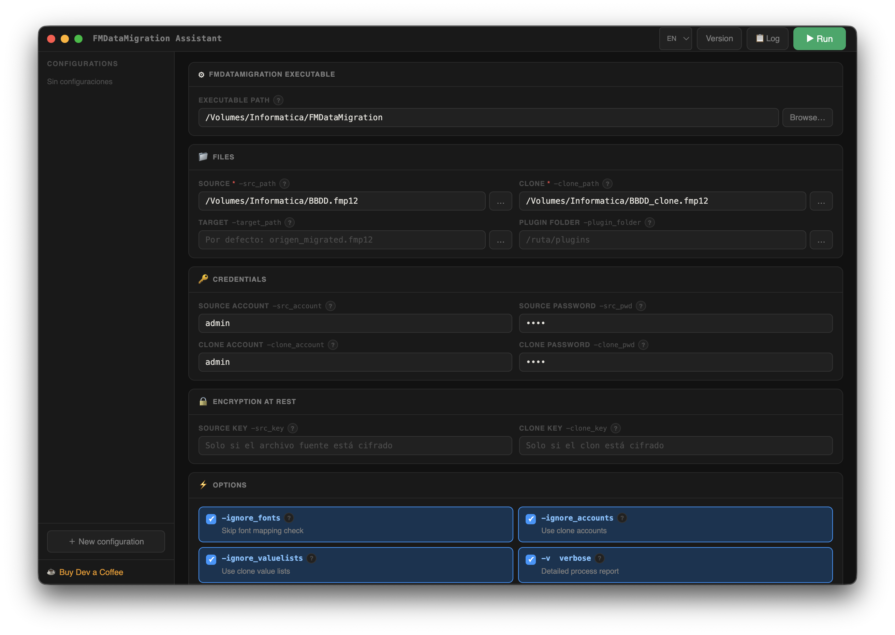

# FMDataMigration Assistant

**English** | [Français](README.fr.md) | [Español](README.md)

---

Graphical interface for the **Claris FileMaker Data Migration Tool** command-line utility (`FMDataMigration`).

Cross-platform desktop app (macOS, Windows) built with Electron. No servers, no runtime dependencies. Run migrations directly from the interface with real-time output.



---

## Features

- **Direct execution** — run `FMDataMigration` without leaving the app, with real-time output
- **Native file pickers** for all paths
- **All official parameters** from FMDataMigration supported
- **Contextual help** for each parameter via the `?` button
- **Multi-language** — English, Español, Français
- **Push notification** to mobile via [Pushover](https://pushover.net) when done (success or failure)
- **Saved configurations** with names, exportable/importable as JSON
- **Shell script generation** for Terminal execution if preferred
- Automatic mutex `-v` / `-q` (verbose/quiet are incompatible)
- Native OS notification on completion

---

## Download

Go to [Releases](../../releases) to download the installer for your platform:

| Platform | File |
|---|---|
| macOS Apple Silicon | `FMDataMigration.Assistant-x.x.x-arm64.dmg` |
| macOS Intel | `FMDataMigration.Assistant-x.x.x.dmg` |
| Windows 64-bit | `FMDataMigration.Assistant.Setup.x.x.x.exe` |

---

## Development

### Requirements

- [Node.js](https://nodejs.org) 18 or higher
- npm

### Install and run

```bash
git clone https://github.com/angelbonet/fmdatamigration-assistant.git
cd fmdatamigration-assistant
npm install
npm start
```

### Build installers

```bash
# macOS (.dmg)
npm run dist:mac

# Windows (.exe NSIS)
npm run dist:win

# Both
npm run dist:all
```

Installers are generated in the `dist/` folder.

---

## Supported parameters

| Parameter | Description |
|---|---|
| `-src_path` | Source file (required) |
| `-src_account` / `-src_pwd` | Source file credentials |
| `-src_key` | Source file encryption key |
| `-clone_path` | Clone file (required) |
| `-clone_account` / `-clone_pwd` | Clone credentials |
| `-clone_key` | Clone encryption key |
| `-target_path` | Target file path |
| `-plugin_folder` | Plugin folder |
| `-ignore_fonts` | Skip font mapping check |
| `-ignore_accounts` | Use clone accounts instead of source |
| `-ignore_valuelists` | Use clone value lists |
| `-v` | Verbose — detailed report |
| `-q` | Quiet — no report |
| `-rebuildindexes` | Rebuild indexes |
| `-reevaluate` | Reevaluate stored calculations |
| `-force` | Overwrite target file |
| `-target_locale` | Target file locale |

Official reference: [Claris Data Migration Tool Guide](https://help.claris.com/en/data-migration-tool-guide/content/migrate-data.html)

---

## Pushover notifications

To receive a push notification on your mobile when migration completes:

1. Create an account at [pushover.net](https://pushover.net)
2. Create an app at [pushover.net/apps/build](https://pushover.net/apps/build) — copy the **API Token**
3. Copy your **User Key** from the dashboard
4. Enter them in the *Pushover Notification* section of the app

---

## Support the project

If you find this software useful, you can support its development:

[](https://buymeacoffee.com/angelbonet)

---

## Author

**Angel Bonet**  
[abdatabase.com](https://abdatabase.com) · [abdatabase@abdatabase.com](mailto:abdatabase@abdatabase.com)

---

## License

MIT
