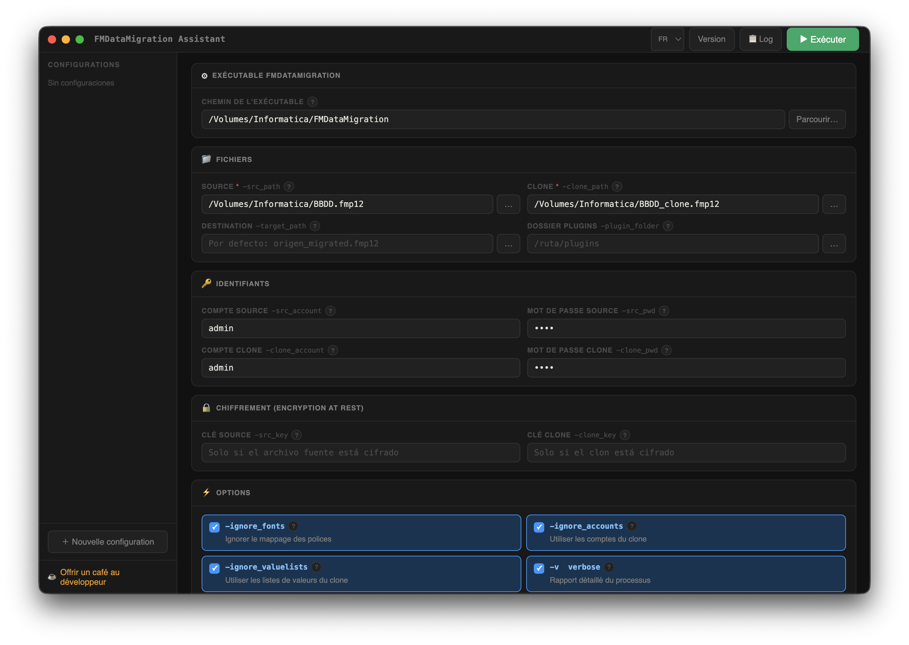

# FMDataMigration Assistant

[English](README.en.md) | **Français** | [Español](README.md)

---

Interface graphique pour l'outil en ligne de commande **Claris FileMaker Data Migration Tool** (`FMDataMigration`).

Application de bureau multiplateforme (macOS, Windows) construite avec Electron. Sans serveur, sans dépendances externes. Exécutez les migrations directement depuis l'interface avec sortie en temps réel.



---

## Fonctionnalités

- **Exécution directe** — lancez `FMDataMigration` sans quitter l'app, avec sortie en temps réel
- **Sélecteurs de fichiers natifs** pour tous les chemins
- **Tous les paramètres officiels** de FMDataMigration supportés
- **Aide contextuelle** pour chaque paramètre via le bouton `?`
- **Multi-langue** — Français, English, Español
- **Notification push** sur mobile via [Pushover](https://pushover.net) à la fin (succès ou échec)
- **Configurations sauvegardées** avec noms, exportables/importables en JSON
- **Génération de script shell** pour exécution en Terminal si préféré
- Mutex automatique `-v` / `-q` (verbose/quiet sont incompatibles)
- Notification native du système à la fin

---

## Téléchargement

Allez dans [Releases](../../releases) pour télécharger l'installateur de votre plateforme :

| Plateforme | Fichier |
|---|---|
| macOS Apple Silicon | `FMDataMigration.Assistant-x.x.x-arm64.dmg` |
| macOS Intel | `FMDataMigration.Assistant-x.x.x.dmg` |
| Windows 64-bit | `FMDataMigration.Assistant.Setup.x.x.x.exe` |

---

## Développement

### Prérequis

- [Node.js](https://nodejs.org) 18 ou supérieur
- npm

### Installer et exécuter

```bash
git clone https://github.com/angelbonet/fmdatamigration-assistant.git
cd fmdatamigration-assistant
npm install
npm start
```

### Compiler les installateurs

```bash
# macOS (.dmg)
npm run dist:mac

# Windows (.exe NSIS)
npm run dist:win

# Les deux
npm run dist:all
```

Les installateurs sont générés dans le dossier `dist/`.

---

## Paramètres supportés

| Paramètre | Description |
|---|---|
| `-src_path` | Fichier source (obligatoire) |
| `-src_account` / `-src_pwd` | Identifiants du fichier source |
| `-src_key` | Clé de chiffrement du fichier source |
| `-clone_path` | Fichier clone (obligatoire) |
| `-clone_account` / `-clone_pwd` | Identifiants du clone |
| `-clone_key` | Clé de chiffrement du clone |
| `-target_path` | Chemin du fichier destination |
| `-plugin_folder` | Dossier des plugins |
| `-ignore_fonts` | Ignorer le mappage des polices |
| `-ignore_accounts` | Utiliser les comptes du clone au lieu de la source |
| `-ignore_valuelists` | Utiliser les listes de valeurs du clone |
| `-v` | Verbose — rapport détaillé |
| `-q` | Quiet — sans rapport |
| `-rebuildindexes` | Reconstruire les index |
| `-reevaluate` | Réévaluer les calculs stockés |
| `-force` | Écraser le fichier destination |
| `-target_locale` | Locale du fichier destination |

Référence officielle : [Claris Data Migration Tool Guide](https://help.claris.com/en/data-migration-tool-guide/content/migrate-data.html)

---

## Notifications Pushover

Pour recevoir une notification push sur mobile à la fin de la migration :

1. Créez un compte sur [pushover.net](https://pushover.net)
2. Créez une app sur [pushover.net/apps/build](https://pushover.net/apps/build) — copiez l'**API Token**
3. Copiez votre **User Key** du tableau de bord
4. Entrez-les dans la section *Notification Pushover* de l'app

---

## Soutenir le projet

Si ce logiciel vous est utile, vous pouvez soutenir son développement :

[](https://buymeacoffee.com/angelbonet)

---

## Auteur

**Angel Bonet**  
[abdatabase.com](https://abdatabase.com) · [abdatabase@abdatabase.com](mailto:abdatabase@abdatabase.com)

---

## Licence

MIT
