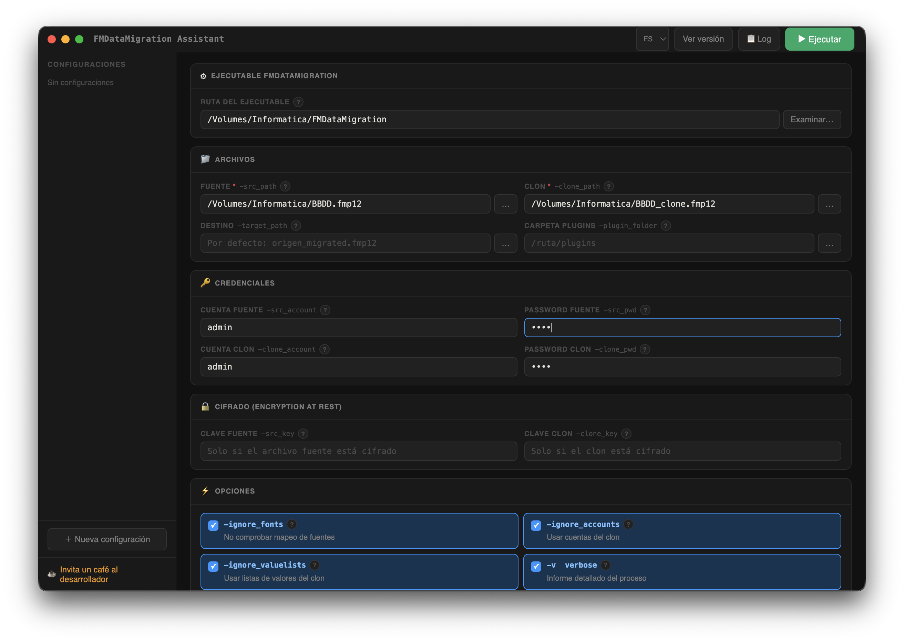

# FMDataMigration Assistant

[English](README.en.md) | [Français](README.fr.md) | **Español**

---

Interfaz gráfica para la herramienta de línea de comandos **Claris FileMaker Data Migration Tool** (`FMDataMigration`).

App de escritorio multiplataforma (macOS, Windows) construida con Electron. Sin servidores, sin dependencias externas en tiempo de ejecución. Ejecuta la migración directamente desde la interfaz y muestra el output en tiempo real.



---

## Características

- **Ejecución directa** — lanza `FMDataMigration` sin salir de la app, con output en tiempo real
- **Selectores de archivo nativos** del sistema operativo para todas las rutas
- **Todos los parámetros oficiales** de FMDataMigration soportados
- **Ayuda contextual** para cada parámetro con el botón `?`
- **Multi-idioma** — Español, English, Français
- **Notificación push** al móvil vía [Pushover](https://pushover.net) al terminar (éxito o fallo)
- **Configuraciones guardadas** con nombre, exportables/importables como JSON
- **Generación de script `.sh`** para ejecución en Terminal si se prefiere
- Mutex automático `-v` / `-q` (verbose/quiet son incompatibles)
- Notificación nativa del SO al terminar

---

## Descarga

Ve a la sección [Releases](../../releases) para descargar el instalador de tu plataforma:

| Plataforma | Archivo |
|---|---|
| macOS Apple Silicon | `FMDataMigration.Assistant-x.x.x-arm64.dmg` |
| macOS Intel | `FMDataMigration.Assistant-x.x.x.dmg` |
| Windows 64-bit | `FMDataMigration.Assistant.Setup.x.x.x.exe` |

---

## Desarrollo

### Requisitos

- [Node.js](https://nodejs.org) 18 o superior
- npm

### Instalar y ejecutar

```bash
git clone https://github.com/angelbonet/fmdatamigration-assistant.git
cd fmdatamigration-assistant
npm install
npm start
```

### Compilar instaladores

```bash
# macOS (.dmg)
npm run dist:mac

# Windows (.exe NSIS)
npm run dist:win

# Ambos
npm run dist:all
```

Los instaladores se generan en la carpeta `dist/`.

---

## Parámetros soportados

| Parámetro | Descripción |
|---|---|
| `-src_path` | Archivo fuente (obligatorio) |
| `-src_account` / `-src_pwd` | Credenciales del archivo fuente |
| `-src_key` | Clave de cifrado del archivo fuente |
| `-clone_path` | Archivo clon (obligatorio) |
| `-clone_account` / `-clone_pwd` | Credenciales del clon |
| `-clone_key` | Clave de cifrado del clon |
| `-target_path` | Ruta del archivo destino resultante |
| `-plugin_folder` | Carpeta de plugins |
| `-ignore_fonts` | No comprobar mapeo de fuentes |
| `-ignore_accounts` | Usar cuentas del clon en lugar del origen |
| `-ignore_valuelists` | Usar listas de valores del clon |
| `-v` | Verbose — informe detallado |
| `-q` | Quiet — sin informe |
| `-rebuildindexes` | Reconstruir índices |
| `-reevaluate` | Reevaluar cálculos almacenados |
| `-force` | Sobreescribir archivo destino |
| `-target_locale` | Locale del archivo destino |

Referencia oficial: [Claris Data Migration Tool Guide](https://help.claris.com/en/data-migration-tool-guide/content/migrate-data.html)

---

## Notificaciones Pushover

Para recibir una notificación push al móvil al terminar la migración:

1. Crea una cuenta en [pushover.net](https://pushover.net)
2. Crea una app en [pushover.net/apps/build](https://pushover.net/apps/build) — copia el **API Token**
3. Copia tu **User Key** del dashboard
4. Introdúcelos en la sección *Notificación Pushover* de la app

---

## Apoyar el proyecto

Si este software te resulta útil, puedes apoyar su desarrollo:

[](https://buymeacoffee.com/angelbonet)

---

## Autor

**Angel Bonet**  
[abdatabase.com](https://abdatabase.com) · [abdatabase@abdatabase.com](mailto:abdatabase@abdatabase.com)

---

## Licencia

MIT
